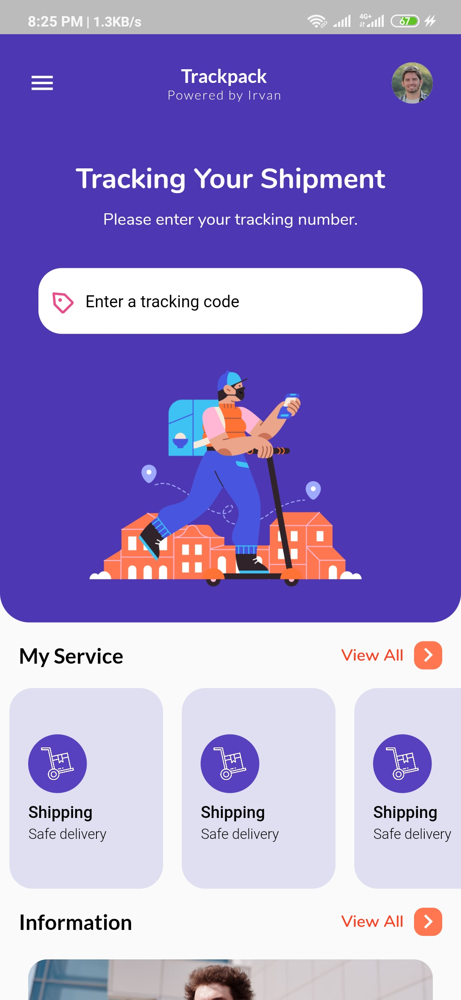
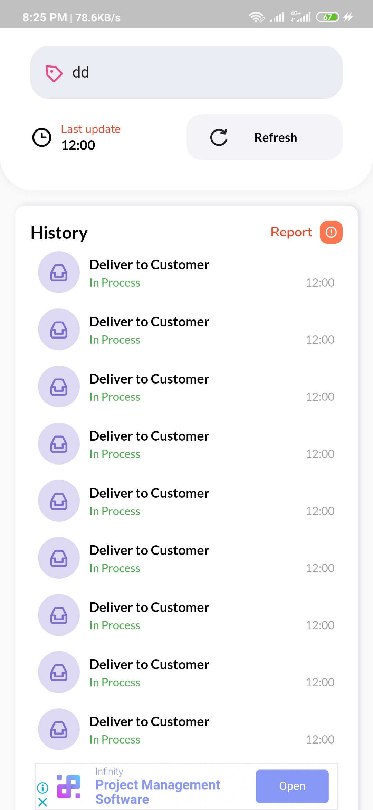
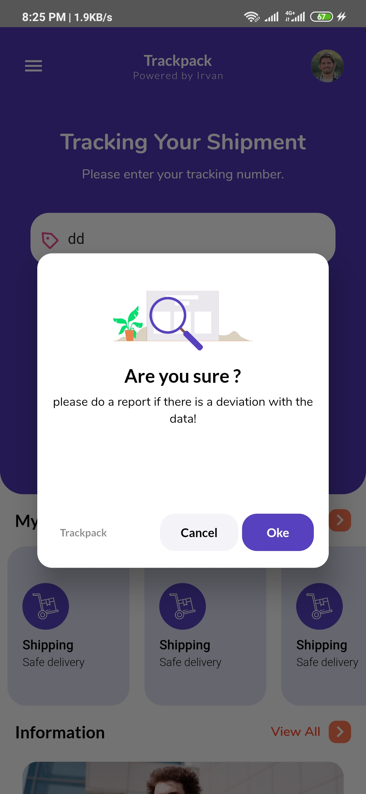

# trackpack
- Flutter apps Design inspired base from https://dribbble.com/shots/8943549-Paypack-Delivery-App
- Bottom menu inspired from https://www.instagram.com/p/CAFriUMgZyF/ (Gojek Home 4.0)
- Dialog design inspired from https://dribbble.com/shots/7119359/attachments/122321?mode=media,
- Detail Page design inspired from https://dribbble.com/shots/11583722-Coody-Food-iOS-UI-Kit-I

<p align="center">
  <a href="https://github.com/agryva">
    </a>
<a href="https://www.linkedin.com/in/irvan-lutfi-gunawan-2488b8151/">
    </a>

# Description
This application is made to hone our ability to create a User Interface that has been created by the UI designer using flutter technology, not only is this application useful for entering admob into the application

# Screenshots


# Gif


# Download
<a href="https://github.com/agryva/trackpack/raw/master/apk/app-release.apk"> Download Release APK </a>

# Getting Started

- Please change application id in Android project or iOS project
- Make a firebase project using new application id that you have made before
- Make a admob project using new application id that you have made before
- sync a admob project with your firebase project (you can see tutorial in google 😁)

### Change Admob Id
put your admob appId, interestid, bannerid in utils.dart file

```dart
  static final String appId = "YOUR KEY" ?? FirebaseAdMob.testAppId;
  static final String interestId = "YOUR KEY" ?? InterstitialAd.testAdUnitId;
  static final String bannerId ="YOUR KEY" ?? BannerAd.testAdUnitId;
```
### Running
```dart
  Flutter build apk
```

## Using Dependencies:

| Dependency Name |               Version                |
| :----------------- | :----------------------------------------------: |
| google_font        |             1.1.0                                |
| cached_network_image           | 2.2.0+1|
| image_ink_well|             ^0.1.0             |
| eva_icons_flutter           |                   2.0.0                   |
| permission_handler|             5.0.0+hotfix.6           |
| flutter_staggered_animations|                "^0.1.2"                 |
| firebase_core            |                0.4.0+9                |
| edge_alert|           0.0.1           |
| firebase_analytics|           5.0.2           |
| firebase_admob|           0.9.3+2          |
| flutter_config|          1.0.7         |
| lottie|          0.3.6        |
| flutter_spinkit|         4.1.2       |

# Donate

> If you found this project helpful or you learned something from the source code and want to thank me, consider buying me a cup of :coffee:
>
> - [PayPal](https://www.paypal.me/agryva/)